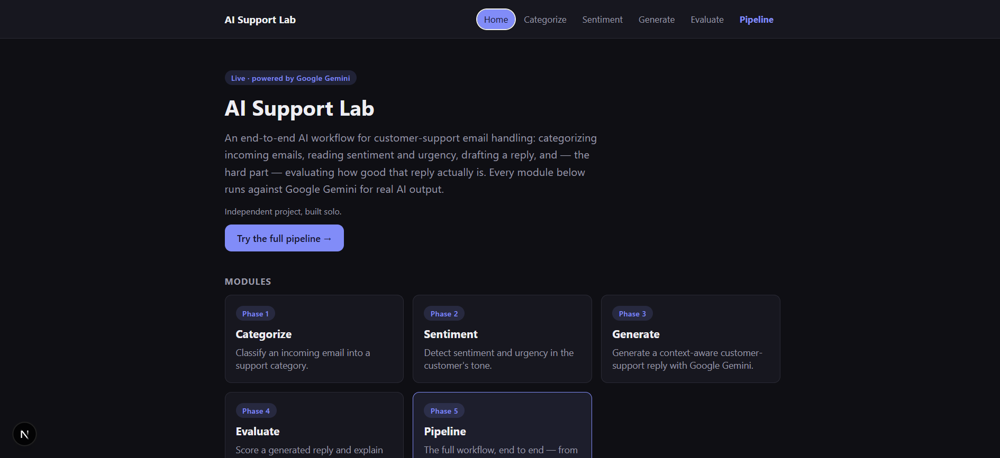
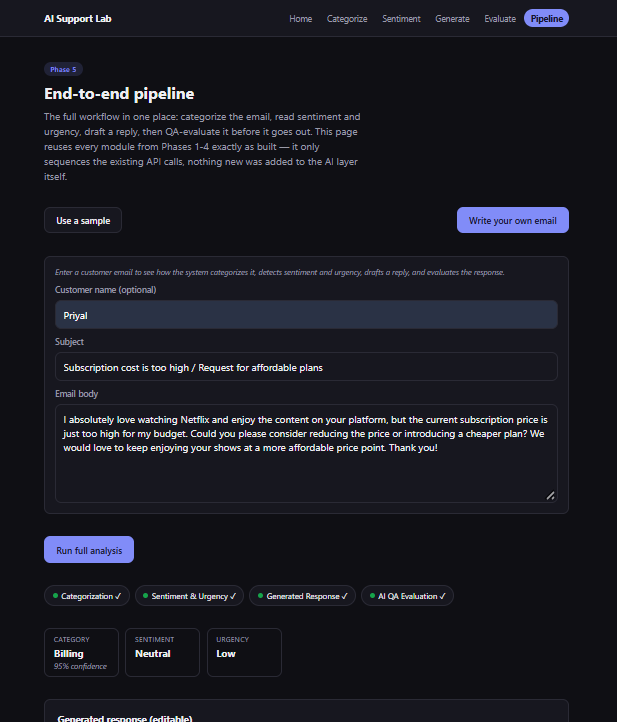
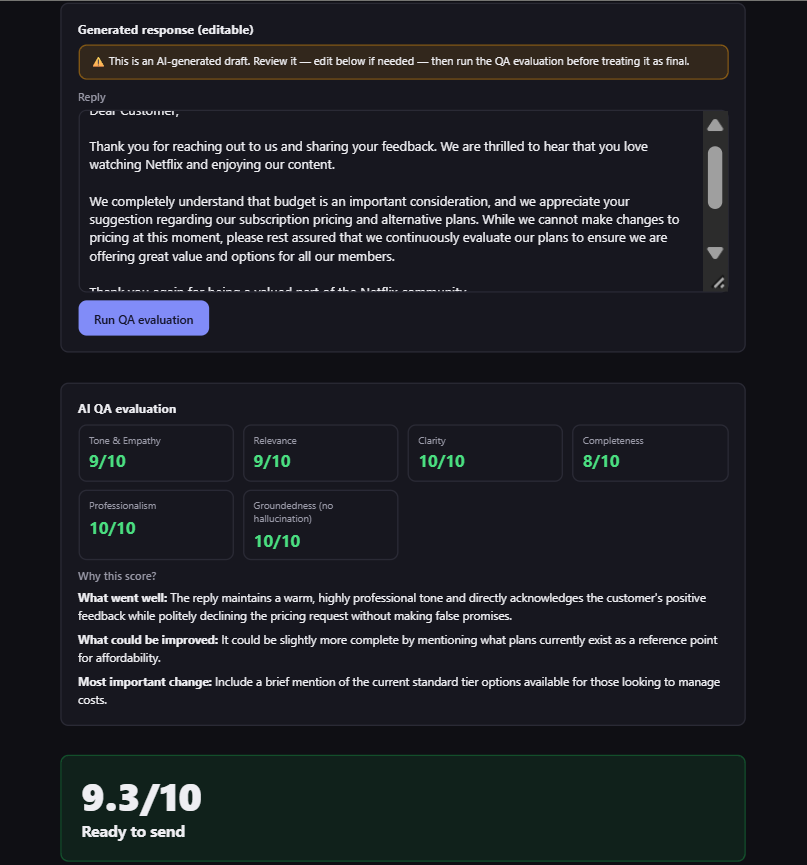

# AI Support Lab

AI Support Lab is an end-to-end workflow for customer-support emails. It categorizes an email, detects sentiment and urgency, generates a reply with Google Gemini, and evaluates the reply before it's sent.

**Live demo:** https://ai-support-lab.vercel.app

> Independent project, built solo.

## Features

- Categorizes an email into one of six support categories, with a confidence score and a reason
- Detects sentiment (positive / neutral / negative) and urgency (low / medium / high)
- Generates a reply with Google Gemini, based on the email's sentiment and urgency
- Evaluates the reply on six quality dimensions and flags risky claims, like unsupported promises or invented policies
- Runs the full pipeline end to end — on a built-in sample email or one you write yourself — with the reply editable before it's scored
- Includes a batch evaluation script that scores the whole dataset and reports an aggregate quality score

## Screenshots

| | |
|---|---|
| Home |  |
| Pipeline — input & analysis |  |
| Generated response & QA evaluation |  |

## How it works

Every AI call goes through one interface:

```ts
type AIProvider = {
  name: string;
  complete: (prompt: string) => Promise<string>;
};
```

- `getProvider()` picks an implementation based on `AI_PROVIDER`: `mock` (keyword-based, no API key needed) or `gemini` (the real Google Gemini API via `@google/genai`, model `gemini-flash-lite-latest`, with automatic retries on transient errors).
- The categorize/sentiment/generate/evaluate modules and the API routes don't know which provider is active — switching is a one-line environment variable change.
- Gemini is only ever called server-side. The API key never reaches the browser.
- Request flow: page → API route → AI module (builds the prompt, validates the response) → provider.
- The pipeline page chains all four steps — categorize → sentiment → generate → evaluate — through the same API routes the individual pages use. It works the same whether you pick a sample ticket or write your own email (subject and body required, sender name optional).

## Tech stack

- Next.js (App Router) + TypeScript
- Google Gemini (`@google/genai`), model `gemini-flash-lite-latest`
- Plain CSS, no UI framework
- Deployed on Vercel

## Evaluation

Every reply is scored 1–10 on six dimensions: tone & empathy, relevance, clarity, completeness, professionalism, and groundedness. It's also checked against five risk flags: unsupported refund promise, unverified fix claim, invented policy or fact, ignored question, and inappropriate tone.

The overall score is the mean of the six dimension scores, computed in code rather than asked of the model. If a critical risk flag shows up — an unsupported promise, an unverified fix, or an invented policy — the score is capped at 4.9, no matter how good the writing is. A confidently-wrong reply shouldn't score well just because it sounds polished.

The batch evaluator's aggregate score is the mean of `overallScore` across all successfully-evaluated emails. Failed requests are left out of the average rather than counted as zero.

## Dataset

`lib/data/sample-emails.ts` has nine hand-written support emails: a billing dispute, a bug report, a feature request, an angry escalation, positive feedback, a refund request, a locked account, a general inquiry, and an outage. Together they cover every sentiment, every urgency level, and every category the app classifies. Both the interactive pages and the batch evaluator use this same dataset.

## Results

A real run against Gemini (`eval-results/latest.json`, `2026-09-17T16:48:25.973Z`):

```json
{
  "id": "bug-report",
  "sentiment": "Negative",
  "urgency": "High",
  "generatedReply": "Dear Customer,\n\nI am very sorry to hear that your team is currently blocked by this PDF upload issue. I understand how urgent this is for your workflow.\n\nI have escalated this matter to our technical team to investigate the failure you are experiencing in Chrome and Firefox. We are treating this with high priority and will follow up with you as soon as we have an update.\n\nThank you for your patience.\n\nSincerely,\nCustomer Support",
  "overallScore": 9.8,
  "riskFlags": []
}
```

The reply mentions specifics from the email (PDF uploads, Chrome/Firefox) that a template couldn't guess — this is real Gemini output, not the mock provider.

Across the full dataset, that run scored **9/9 emails successfully evaluated**, with an aggregate overall score of **7.11/10**. Five replies were capped for making an unverified promise or claim.

## Setup

```bash
npm install
cp .env.example .env.local
npm run dev
```

Open http://localhost:3000.

| Variable | Required | What it does |
|---|---|---|
| `AI_PROVIDER` | No (defaults to `mock`) | `mock` runs with no API key. `gemini` uses the real model. |
| `GEMINI_API_KEY` | Only if `AI_PROVIDER=gemini` | Your key from [Google AI Studio](https://aistudio.google.com/apikey). Used server-side only. |

## Batch evaluation

```bash
npm run evaluate:batch
```

Runs generation and evaluation across the whole dataset using the real Gemini provider, and writes the results to `eval-results/latest.json`.

- Requests are sequential and paced to stay under the Gemini free tier's rate limit (`EVAL_BATCH_REQUEST_DELAY_MS`, default 4500ms).
- Already-successful emails are skipped on re-runs — only missing or failed ones are retried. `EVAL_BATCH_LIMIT` caps how many new ones a single run attempts.
- A failed request is recorded as an error, never turned into a fake score.
- The report includes per-email results (reply, scores, risk flags, rationale) plus the aggregate score.

## Project structure

```
app/
  api/{categorize,sentiment,generate,evaluate}/   API routes (server-side only)
  {categorize,sentiment,generate,evaluate}/       Individual pages
  pipeline/                                        End-to-end workflow page
components/                                        Shared UI
lib/ai/provider.ts        The mock + Gemini provider layer
lib/ai/categorize.ts      Categorization prompt + validation
lib/ai/sentiment.ts       Sentiment/urgency prompt + validation
lib/ai/generate.ts        Reply generation prompt + validation
lib/ai/evaluate.ts        Reply evaluation prompt + validation + scoring
lib/ai/categories.ts, sentiment-labels.ts, score-dimensions.ts, risk-flags.ts
                           Fixed lists shared by server and client code
lib/data/sample-emails.ts        The 9-email dataset
lib/data/sample-evaluations.ts   Good/poor reply pairs for the evaluate demo
lib/data/pipeline-samples.ts     Sample tickets for the pipeline demo
scripts/evaluate-batch.ts        Batch evaluation runner
eval-results/                    Generated batch reports (gitignored)
```

## Roadmap

| Capability | Status | Notes |
|---|---|---|
| Categorization | Done | Structured JSON output, fixed category list |
| Sentiment & urgency | Done | Two signals from one prompt |
| Reply generation | Done | Grounded in detected sentiment/urgency (not retrieval-based) |
| Response evaluation | Done | Six-dimension rubric + risk flags, overall score computed in code |
| Pipeline | Done | Sample or custom email, all four steps chained together |
| Gemini provider | Done | Real model wired in; mock kept as a fallback |
| Batch evaluation | Done | Resumable, paced, aggregate scoring |
| Deployment | Done | Live on Vercel with `AI_PROVIDER=gemini` |

Possible next steps: a bigger dataset, CI-triggered batch runs, and support for other providers (OpenAI, Claude) behind the same interface.
