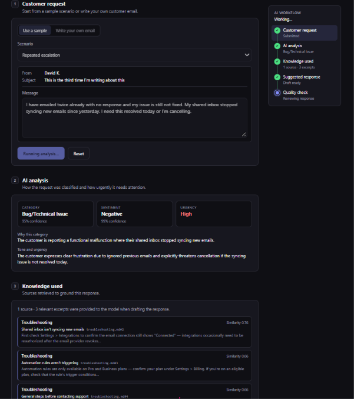
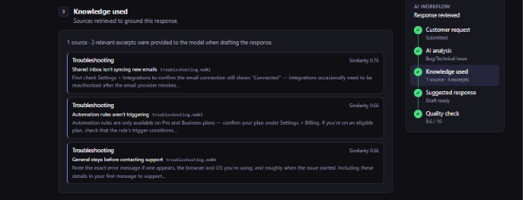
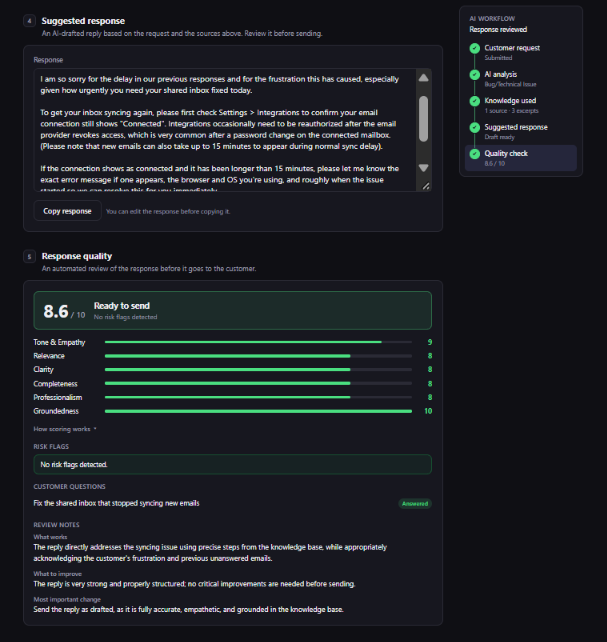

# AI Support Lab

AI Support Lab is an end-to-end workflow for customer-support emails. It categorizes an email, detects sentiment and urgency, retrieves relevant knowledge-base articles, generates a grounded reply with Google Gemini, and evaluates the reply before it's sent.

**Live demo:** https://ai-support-lab.vercel.app

> Independent project, built solo.

## Features

- Categorizes an email into one of six support categories, with a confidence score and a reason
- Detects sentiment (positive / neutral / negative) and urgency (low / medium / high)
- Checks the email is actually about the product, then retrieves the most relevant knowledge-base excerpts (RAG) and shows them in a **Knowledge used** card
- Generates a reply with Google Gemini, grounded in those excerpts and the detected sentiment/urgency
- Evaluates the reply on six quality dimensions against the same excerpts, and flags risky claims like unsupported promises or invented policies
- Runs the full pipeline end to end on one page — on a built-in sample email or one you write yourself. The reply is scored automatically, and can be edited and re-checked
- Includes a batch evaluation script and a 12-case evaluator benchmark

## Screenshots

| | |
|---|---|
| Pipeline — input & analysis |  |
| Knowledge used — RAG retrieval |  |
| Generated response & QA evaluation |  |

## How it works

Every text-generation call goes through one interface:

```ts
type AIProvider = {
  name: string;
  complete: (prompt: string) => Promise<string>;
};
```

- `getProvider()` picks an implementation based on `AI_PROVIDER`: `mock` (keyword-based, no API key needed) or `gemini` (the real Google Gemini API via `@google/genai`, model `gemini-flash-lite-latest`, with automatic retries on transient 429/503 errors).
- The AI modules and API routes don't know which provider is active — switching is a one-line environment variable change.
- Gemini is only ever called server-side. The API key never reaches the browser.
- Request flow: page → API route → AI module (builds the prompt, validates the response) → provider.
- The pipeline chains **categorize → sentiment → scope check → retrieve knowledge → generate → evaluate**. The chunks retrieved for generation are passed unchanged to the evaluator, so groundedness is judged against exactly what the model saw.

## Tech stack

| Area | Technology |
|---|---|
| Framework | Next.js (App Router) + TypeScript |
| Generation & evaluation | Google Gemini (`@google/genai`), model `gemini-flash-lite-latest` |
| Embeddings | Gemini `gemini-embedding-001` (768 dimensions) |
| Retrieval (RAG) | Cosine similarity over a committed JSON index — no vector database |
| Styling | Plain CSS |
| Hosting | Vercel |

## Knowledge base (RAG)

- **Source:** 6 markdown documents in `knowledge/` (refunds, cancellation, billing, plans, account help, troubleshooting), split by section into **32 chunks**.
- **Index:** each chunk is embedded with Gemini `gemini-embedding-001` (**768 dimensions**) and stored in `lib/ai/knowledge/knowledge-index.json`, which is committed — no vector database needed. Rebuild it with `npm run index:knowledge` after editing `knowledge/`.
- **Scope guard:** before retrieval, one short model call (`lib/ai/support-scope.ts`) judges whether the customer's request is actually about our product. Similarity alone can't tell "Netflix's plans" from "our plans": "How much does Netflix Premium cost?" scores 0.61 against our plans document. Out-of-scope emails retrieve **zero** chunks, and the model is told to explain politely what support can help with, without applying our policies. If the scope check itself fails, it falls back to normal retrieval. It is skipped with the mock provider.
- **Retrieval:** the email is embedded at request time and ranked against the index by **cosine similarity**. Chunks scoring below **0.60** (configurable via `KNOWLEDGE_MIN_SIMILARITY`) are discarded, and the **top 3** of the rest go into the generation prompt. An email with nothing relevant can therefore retrieve no chunks; the model is then told no relevant knowledge was found and must not invent company-specific facts.
- **Evaluation:** the **same** chunks (up to 3, possibly none) are passed to the evaluator. A company-specific claim counts as grounded only if the email or those chunks support it.
- **UI and API:** the pipeline's **Knowledge used** card shows the retrieved sources and similarity scores. `POST /api/knowledge/search` with `{ "query": "..." }` (optional `topK`) returns ranked chunks directly.
- Embeddings need `GEMINI_API_KEY`; there is no mock embedding provider. In keyless mock mode, retrieval is skipped so the demo still runs. If retrieval fails with a key set, generation fails with a clear error rather than silently drafting an ungrounded reply.

## Evaluation

Each reply gets one evaluator call that works in a fixed order:

1. **Question-by-question analysis** — every distinct customer question/request is marked `answered`, `partly answered` or `unanswered`.
2. **Feedback** — strengths, improvements, and a top suggestion.
3. **Six dimension scores (1–10)** — tone & empathy, relevance, clarity, completeness, professionalism, groundedness — against an anchored rubric with hard limits (e.g. relevance ≤ 5 for a generic reply; groundedness ≤ 4 for an unsupported claim, ≤ 6 for a real policy applied incorrectly).
4. **Risk flags** from a fixed list.

The model's scores are then checked in code, and the overall score is computed in code — never asked of the model:

- **Consistency rules:** any `unanswered` question forces the *Ignored customer's question* flag and caps completeness (≤ 6 for one, ≤ 4 for two or more, ≤ 5 whenever that flag is present). Any critical flag caps groundedness at 4.
- **Weighted average:** relevance 25%, groundedness 25%, completeness 20%, tone & empathy 10%, clarity 10%, professionalism 10%.
- **Weakest-dimension ceiling:** overall ≤ weakest dimension + 1.5, so strong writing can't hide one failing dimension.
- **Risk-flag caps:**

  | Severity | Flags | Overall capped at |
  |---|---|---|
  | Critical | Unsupported refund promise, Unverified fix claim, Invented policy or fact | 4.9 (*Do not send*) |
  | Major | Ignored customer's question, Inappropriate tone | 6.9 (never *Ready to send*) |

- **Overall** = the lowest of those three. Labels: ≥ 8 *Ready to send*, ≥ 5 *Needs revision*, otherwise *Do not send as-is*.

**Calibration.** 8 is the normal score for a correct, complete, well-written reply. A dimension reaches 9 only for a specific, observable strength beyond the basics (e.g. anticipating an obvious follow-up), and 10 is reserved for exceptional execution. Groundedness is scored on accuracy alone: 9–10 when every company claim is supported and correctly applied.

**Malformed output.** If the model returns output that breaks the expected JSON shape (e.g. an unknown question status), the evaluator retries the same request once. Invalid values are never coerced; if the retry is also invalid, the request fails as before. Provider/API errors don't trigger this retry.

The standalone `/evaluate` page scores a reply against the email only, since it has no retrieval step; the pipeline and batch script pass the retrieved chunks.

## Current batch evaluation

`npm run evaluate:batch` runs the **whole system** — scope check, retrieval, generation and evaluation — on the 9 sample emails (see [Dataset](#dataset)). This is different from the evaluator benchmark below, which tests only the evaluator on fixed replies.

**Latest run** (2026-09-28, full output in [`docs/evaluation/batch-latest.json`](docs/evaluation/batch-latest.json)):

| Emails evaluated | Mean overall | Ready to send | Needs revision | Do not send |
|---|---|---|---|---|
| 9/9 | **8.36 / 10** | 8 | 1 | 0 |

| Tone & empathy | Relevance | Clarity | Completeness | Professionalism | Groundedness |
|---|---|---|---|---|---|
| 8.44 | 8.11 | 8.11 | 7.56 | 8.11 | 10.00 |

Per email, overall scores ranged from 6.5 to 9.3.

**The one failure is a real catch.** In `neutral-inquiry` the customer asks how many shared inboxes the team plan allows. The knowledge base documents user seats but not a shared-inbox limit, and the reply talked about seats without saying the inbox limit wasn't documented. The evaluator marked the question unanswered, raised *Ignored customer's question*, and scored completeness 5; the score caps brought the overall to **6.5** (*Needs revision*). That's the intended behavior: an incomplete answer is caught rather than passed.

**How to read these numbers.** They are model-judged: the evaluator uses the same Gemini model family as the generator, and no human reviewed the scores. Groundedness of 10.00 on every email means the evaluator found no unsupported company claims — not that the replies were independently fact-checked. With 9 emails this is a snapshot of the current system, not a measure of accuracy.

## Evaluator benchmark

`npm run benchmark:evaluator` tests the **evaluator itself** — not the generation model — using 12 hand-written cases (`lib/data/evaluator-benchmark.ts`).

- **Design:** 4 customer emails, each with several deliberately written replies, so score differences come from the reply alone. Each case fixes the sentiment/urgency and a **frozen** set of knowledge-base chunks, and calls only `evaluateReply()` — no generation or retrieval.
- **Coverage:** good grounded reply; grounded but incomplete; grounded but generic; ignored question; invented policy; real policy applied incorrectly; unsupported promise; inappropriate tone; missing customer info handled correctly; a correct refusal; a good reply to an angry escalation; and a control with the same good reply but no retrieved context.
- **Checks:** score ranges, labels, required/forbidden flags, per-dimension limits and question statuses. Each check is tagged *automatic* (guaranteed by code once the model raises the triggering signal) or *instruction-based* (depends on the model following the rubric). Flag checks must hold on every run; score checks on at least 2 of 3.

**Latest result** (2026-09-28, 3 runs per case; full output in [`docs/evaluation/benchmark-latest.json`](docs/evaluation/benchmark-latest.json)):

| Cases passed | Runs completed | Automatic checks | Instruction-based checks | Informational checks |
|---|---|---|---|---|
| 12/12 | 36/36 | 15/15 | 47/47 | 8/8 |

**What this is — and isn't.** It is a behavioral regression suite: it shows the evaluator catches each targeted failure mode and doesn't raise false alarms on good replies. It is **not** a statistical measure of agreement with human reviewers. Known limitations:

- A small, hand-written set by one author, with roughly one case per failure mode.
- The 8/9/10 calibration was tuned against BM-01, BM-07 and BM-11, so those three cases are no longer independent evidence.
- Scores vary between runs on identical input — up to 2.0 points in the published run (BM-05 scored 2.5, 3.5 and 4.5, all still *Do not send*).
- The boundary between flawed and good replies is thin: in the published run the best flawed reply scored 7.5 and the weakest good reply 7.8.
- Flag labels can vary between runs. A repeat run on 2026-09-28 scored 11/12: in one of BM-08's three runs, the evaluator labeled the reply's unverified fix claim as *Invented policy or fact* instead of *Unverified fix claim*. The critical failure was still caught in all 3 runs — overall score (2.5), verdict (*Do not send*) and groundedness (1) were unchanged — but the check requires the exact flag on every run.
- The evaluator is occasionally inconsistent about whether an agent's own follow-up commitment ("I'll check back by end of day") is an unsupported claim, and sometimes raises *Ignored customer's question* when no question is marked `unanswered`.

## Dataset

`lib/data/sample-emails.ts` has nine hand-written support emails: a billing dispute, a bug report, a feature request, an angry escalation, positive feedback, a refund request, a locked account, a general inquiry, and an outage. Together they cover every sentiment, every urgency level, and every category the app classifies. The batch evaluator and the standalone pages use this dataset; the pipeline page has 5 sample tickets of its own (`lib/data/pipeline-samples.ts`), and the benchmark has its own 12 cases (above).

## Setup

```bash
npm install
cp .env.example .env.local
npm run dev
```

Open http://localhost:3000.

| Variable | Required | What it does |
|---|---|---|
| `AI_PROVIDER` | No (defaults to `mock`) | `mock` runs with no API key. `gemini` uses the real model. |
| `GEMINI_API_KEY` | For `gemini`, retrieval, and the scripts below | Your key from [Google AI Studio](https://aistudio.google.com/apikey). Used server-side only; keep it in `.env.local`, which is gitignored. |
| `GEMINI_EMBEDDING_MODEL`, `GEMINI_EMBEDDING_DIMENSIONS` | No | Override the embedding model (default `gemini-embedding-001`) and size (default `768`). Rebuild the index if you change them. |
| `KNOWLEDGE_MIN_SIMILARITY` | No | Minimum cosine similarity (0–1) for a chunk to be used. Default `0.6`. |
| `DEBUG_SUPPORT_SCOPE` | No | Set to log the scope-guard decision server-side in production. It is always logged in development. |

## Scripts

```bash
npm test                     # offline unit tests (no API key needed)
npm run test:live            # live scope-guard + retrieval checks against Gemini
npm run index:knowledge      # re-embed knowledge/*.md into lib/ai/knowledge/knowledge-index.json
npm run evaluate:batch       # generate + evaluate every sample email with real Gemini
npm run benchmark:evaluator  # run the 12-case evaluator benchmark
```

Everything except `npm test` calls the real Gemini API and reads `.env.local` itself. `npm run test:live` makes one scope call per case plus one embedding call per in-scope case — no reply generation.

**Batch evaluation** writes `eval-results/latest.json`: per-email replies, scores, risk flags and rationale, plus an aggregate (the mean `overallScore` of successful items — failures are recorded as errors, never as zero). Requests are paced for the free tier (`EVAL_BATCH_REQUEST_DELAY_MS`, default 4500ms); re-runs skip emails that already succeeded, and `EVAL_BATCH_LIMIT` caps new attempts per run. To start a fresh run, move `eval-results/latest.json` and any `eval-results/batch-*.json` out of the folder first.

**Evaluator benchmark** writes `eval-results/benchmark-latest.json` and prints a pass/fail summary. Options:

- `BENCHMARK_RUNS` — runs per case (default `3`).
- `BENCHMARK_CASES` — comma-separated case IDs to run only those, e.g. `BM-01,BM-06` (default: all).
- `BENCHMARK_REQUEST_DELAY_MS` — spacing between Gemini requests (default `4500`).

A full run is 36 requests (~3 minutes). `eval-results/` is gitignored; the latest reports are copied to `docs/evaluation/` for review.

## Project structure

```
app/
  api/{categorize,sentiment,generate,evaluate}/   API routes (server-side only)
  api/knowledge/search/                            Knowledge search endpoint
  pipeline/                                        Support workspace — the main UI (/ redirects here)
  {categorize,sentiment,generate,evaluate}/        Standalone single-step pages (not in the nav)
components/                                        Shared UI
knowledge/                                         Knowledge-base source documents (markdown)
lib/ai/provider.ts        The mock + Gemini provider layer
lib/ai/categorize.ts      Categorization prompt + validation
lib/ai/sentiment.ts       Sentiment/urgency prompt + validation
lib/ai/support-scope.ts   Scope guard: is the email about our product?
lib/ai/generate.ts        Scope check + retrieval + grounded reply generation
lib/ai/evaluate.ts        Evaluation prompt + validation + scoring
lib/ai/knowledge/         Chunking, embeddings, retrieval, and the committed index
lib/ai/categories.ts, sentiment-labels.ts, score-dimensions.ts, risk-flags.ts
                           Fixed lists shared by server and client code
lib/data/sample-emails.ts        The 9-email dataset
lib/data/sample-evaluations.ts   Good/poor reply pairs for the evaluate demo
lib/data/pipeline-samples.ts     Sample tickets for the pipeline demo
lib/data/evaluator-benchmark.ts  The 12 evaluator benchmark cases
scripts/index-knowledge.ts       Builds the knowledge index
scripts/evaluate-batch.ts        Batch evaluation runner
scripts/benchmark-evaluator.ts   Evaluator benchmark runner
tests/unit/support-scope.test.ts Offline tests for the scope guard and retrieval gate
tests/live/support-scope.test.ts Live scope-guard + retrieval checks (Gemini)
docs/evaluation/                 Latest batch + benchmark reports, for reviewers
eval-results/                    Generated reports (gitignored)
```

## Roadmap

| Capability | Status | Notes |
|---|---|---|
| Categorization | Done | Structured JSON output, fixed category list |
| Sentiment & urgency | Done | Two signals from one prompt |
| Knowledge base (RAG) | Done | 6 docs / 32 chunks, Gemini embeddings, cosine similarity with a 0.60 floor, top 3; scope guard blocks retrieval for out-of-scope emails |
| Reply generation | Done | Grounded in retrieved knowledge plus sentiment/urgency |
| Response evaluation | Done | Six-dimension rubric, risk flags, weighted score with caps computed in code |
| Evaluator benchmark | Done | 12 cases, 3 runs each, 12/12 passing |
| Pipeline | Done | One-page support workspace: sample or custom email, all steps chained together |
| Gemini provider | Done | Real model wired in; mock kept as a fallback |
| Batch evaluation | Done | Resumable, paced, aggregate scoring; latest run 9/9, mean 8.36 |
| Deployment | Done | Live on Vercel with `AI_PROVIDER=gemini` |

Possible next steps: a larger, independently labelled benchmark to measure agreement with human reviewers, CI-triggered benchmark runs, and support for other providers behind the same interface.
